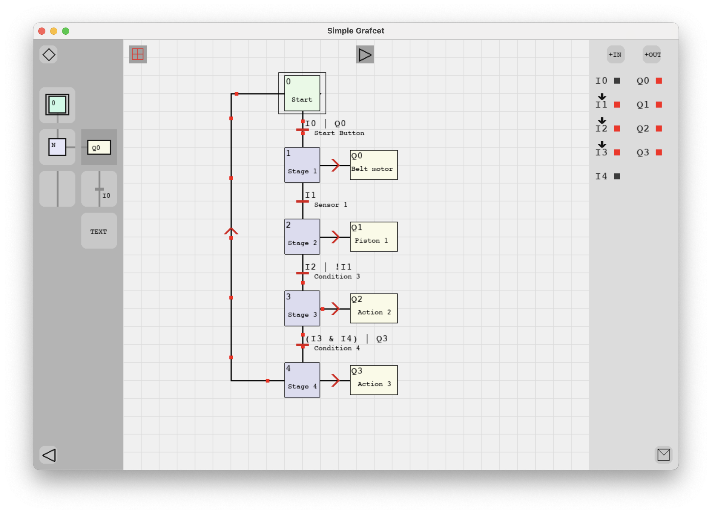

# Simple GRAFCET
 
A Simple simulator for designing and testing sequential logic using GRAFCET diagrams (commonly used in PLC systems).



## 🚀 Features

- Logic evaluation using inputs (`I0`, `I1`, ...) and outputs (`Q0`, `Q1`, ...)
- Supports logical operators: `&` (AND), `|` (OR), `!` (NOT), and parentheses
- Visual rendering and interaction via Pygame
- Undo system with `Ctrl + Z`
- Clear, editable structure for easy logic testing and visualization

## Requerimientos

- Python 3.9+
- [Pygame](https://www.pygame.org/)

## How to Use

1. Clone the repository:
```bash
    git clone https://github.com/Ranguel/SimpleGRAFCET
    cd SimpleGRAFCET
```
2.	Run the simulator:
```bash
    python main.py
```